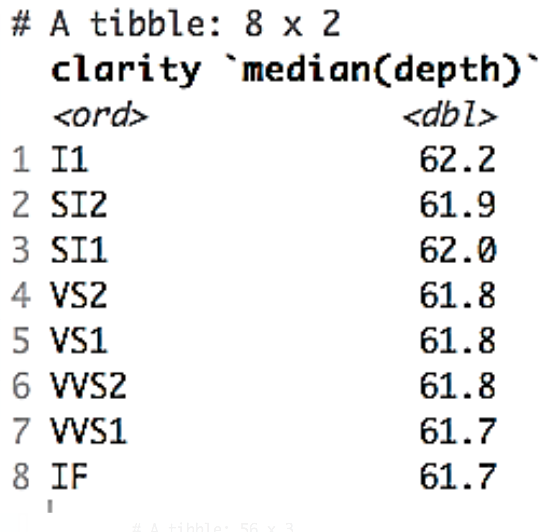
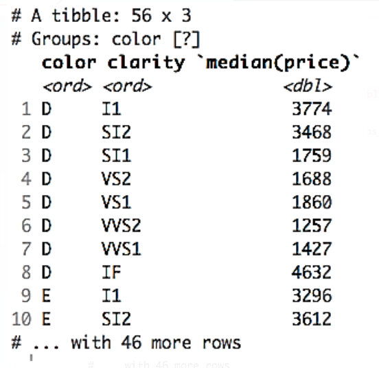
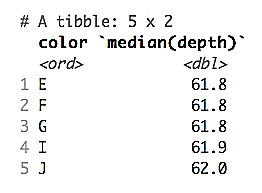

# Activity: Creating Data Summarization Tables
## Scenario

You've been asked at work to dig deeper into the diamonds package because your boss is interested in investing company funds in diamonds. Create some explanatory data tables using base R and the dplyr methods.

## Aim

To construct basic summary tables by recreating the ones given.

## Prerequisites

You must have RStudio and R installed on your machine. The datasets package should also be installed.

## Steps for Completion

1. Load the dplyr package.
2. Load the diamonds dataset, contained in the datasets package. Examine the dataset with str():

- 

3. Recreate the following summary tables using the table() and dplyr methods.

- The counts of the diamonds' clarity by price are as follows:

- 

- The counts of the diamonds' clarity by color are as follows:

- 
