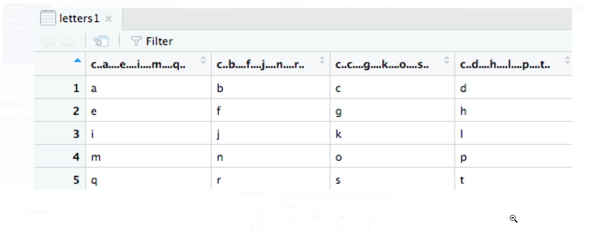
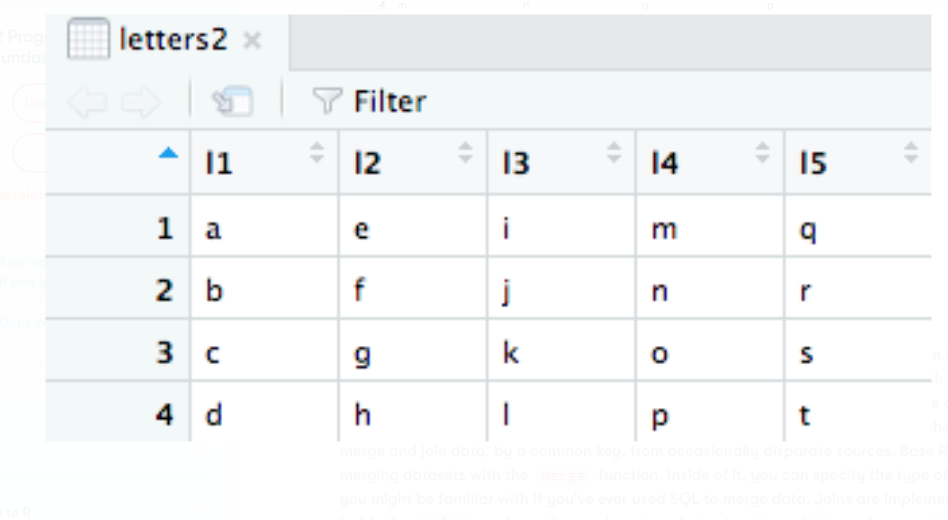

# 4Activity: Demonstrating Splitting and Combining Data
## Scenario

You need to split the mtcars dataset by cylinder type for a project. You also want to recombine the datasets to understand the power of combining data in R.

## Aim

To get comfortable with both splitting and combining datasets.

## Prerequisites

Make sure you have R and RStudio installed on your machine.

## Steps for completion

1. Load the mtcars dataset.
2. Split the data by the cyl variable.
3. Create a dataset for each level of cyl.
4. Recreate mtcars by unsplitting the split version of the data.
5. Create the following two datasets by combining the data:

- letters1 dataset:

- letters2 dataset:

Solution:  https://github.com/fenago/r/blob/main/lesson3/lesson3_activityC1.R
