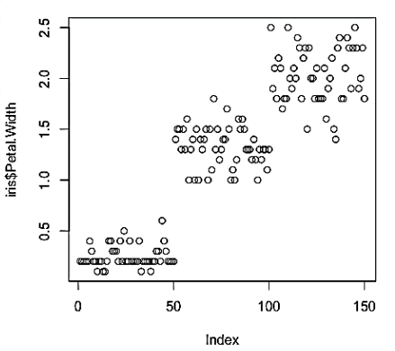
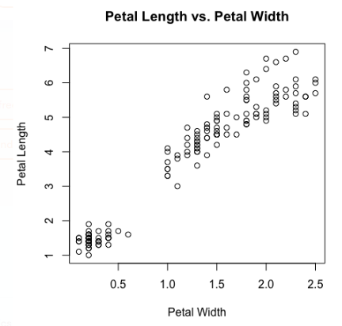
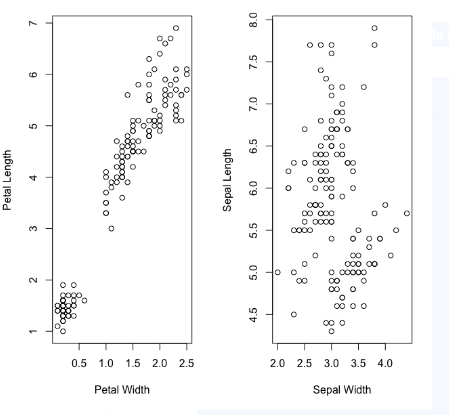
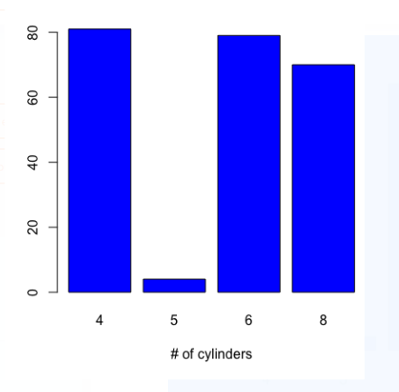

# Activity: Recreating Plots with Base Plot Methods
## ScenarioScenario

You have been asked to create some base plots that provide information on the mtcars and iris datasets for a junior colleague.

## Prerequisites

Make sure you have R and RStudio installed on your machine.

## Aim

To use plot() by recreating different plots with different base plot methods.

## Steps for completion

1. Load the datasets library using library(datasets).
2. Load the iris and mpg datasets. You will need to make individual calls, using data("mtcars"), for example. You will then see the dataset in your environment as a promise. It will appear as a dataset in your list of datasets in the upper-right window when you first attempt to use it.
3. Recreate the following base plots using iris data:

A scatterplot to plot petal width without axis labels:

A scatterplot to plot petal length and width with axis labels:

Scatterplots in 1 × 2 grids to plot petal length and width with axis labels:

- Recreate the following histogram using mtcars data to plot the number of cylinders in the color blue:

Solution:  https://github.com/fenago/r/blob/main/lesson2/lesson2_activityA.R
