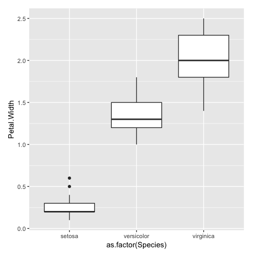

# Activity: Recreating Plots Using ggplot2
## Scenario

You have been asked to create some ggplots that provide information on the mtcars and iris datasets for a presentation in your office.

## Prerequisites

You should have RStudio and R installed on your machine. The ggplot2 package should also be installed.

## Aim

To construct basic ggplots by recreating some of those shown in the preceding exercises.

## Steps for Completion

1. Load ggplot2 using library(ggplot2).
2. Try to recreate all of the following ggplots using the iris dataset:
A histogram to plot petal width:

A scatterplot to plot petal length and width:

Boxplot to plot petal width and the Species factor variable:

9. Try to recreate the following bar chart ggplot using the gear variable of the mtcars dataset:

