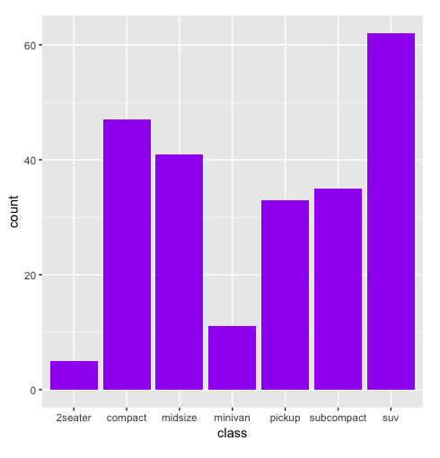

# Activity: Utilizing ggplot2 Aesthetics
## Scenario

You have been asked to create some ggplots that provide information on the mtcars and iris datasets for a presentation for your colleague, as shown in the following screenshot:

## Aim

To get the students comfortable with using more aesthetic options in their ggplots by having them recreate a few, as shown.

## Prerequisites

Make sure you have R and RStudio installed on your machine. The ggplot2 package should also be installed.

## Steps for Completion

1. Load ggplot2 using library(ggplot2).
2. Try to recreate the ggplots shown as follows.
3. The plots use the following datasets:

- Plots 1 and 2: mpg

- Plots 3 and 4: diamonds

